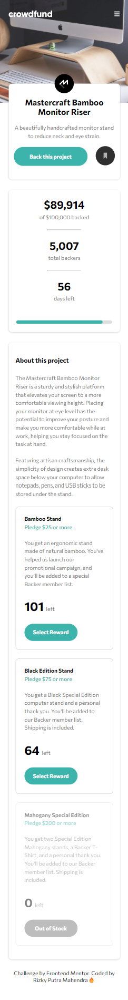
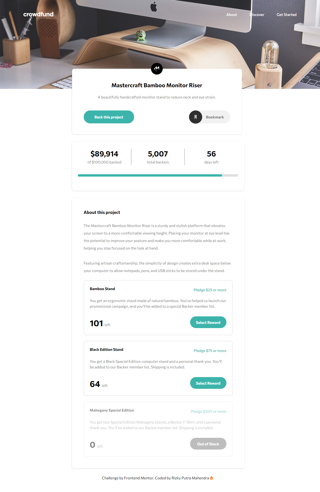

# Frontend Mentor - Crowdfunding product page solution

This is a solution to the [Crowdfunding product page challenge on Frontend Mentor](https://www.frontendmentor.io/challenges/crowdfunding-product-page-7uvcZe7ZR). Frontend Mentor challenges help you improve your coding skills by building realistic projects.

## Table of contents

-   [Overview](#overview)
    -   [The challenge](#the-challenge)
    -   [Screenshot](#screenshot)
    -   [Links](#links)
-   [My process](#my-process)
    -   [Built with](#built-with)
    -   [Useful resources](#useful-resources)
-   [Author](#author)

## Overview

### The challenge

Users should be able to:

-   View the optimal layout depending on their device's screen size
-   See hover states for interactive elements
-   Make a selection of which pledge to make
-   See an updated progress bar and total money raised based on their pledge total after confirming a pledge
-   See the number of total backers increment by one after confirming a pledge
-   Toggle whether or not the product is bookmarked

### Screenshot

### Links

-   Solution URL: [Github](https://github.com/rizky-pm/crowdfunding-product-page)
-   Live Site URL: [Github Pages](https://rizky-pm.github.io/crowdfunding-product-page/)

## My process

### Built with

-   Semantic HTML5 markup
-   CSS custom properties
-   Flexbox
-   CSS Grid
-   Mobile-first workflow
-   SCSS

### Useful resources

-   [Styling a radio button with only CSS](https://dev.to/kallmanation/styling-a-radio-button-with-only-css-4llc)
-   [How to improve web accessibility by hiding elements](https://www.nomensa.com/blog/how-improve-web-accessibility-hiding-elements)
-   [Pure CSS Custom Checkbox Style](https://moderncss.dev/pure-css-custom-checkbox-style/)

## Author

-   Frontend Mentor - [@rizky-pm](https://www.frontendmentor.io/profile/rizky-pm)
-   Twitter - [@\_rizkypm](https://twitter.com/_rizkypm)
